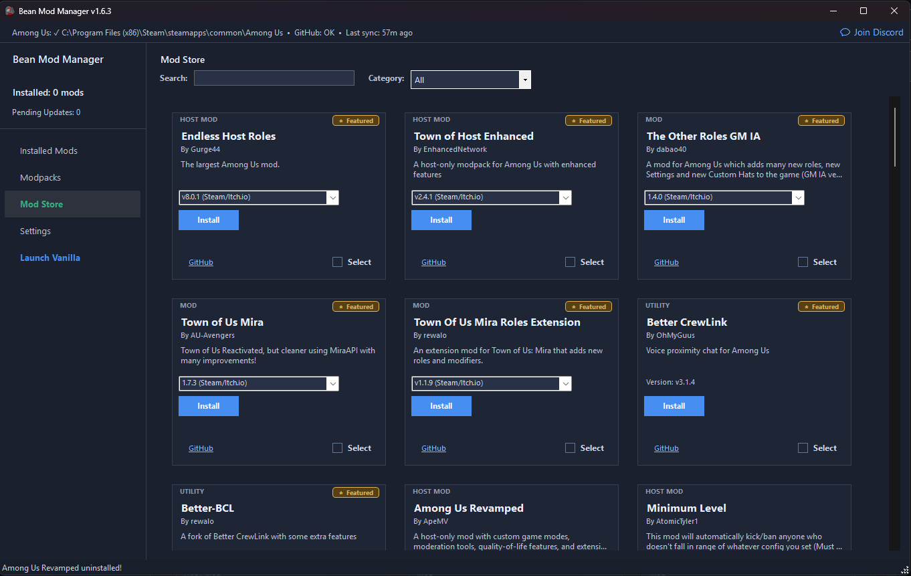
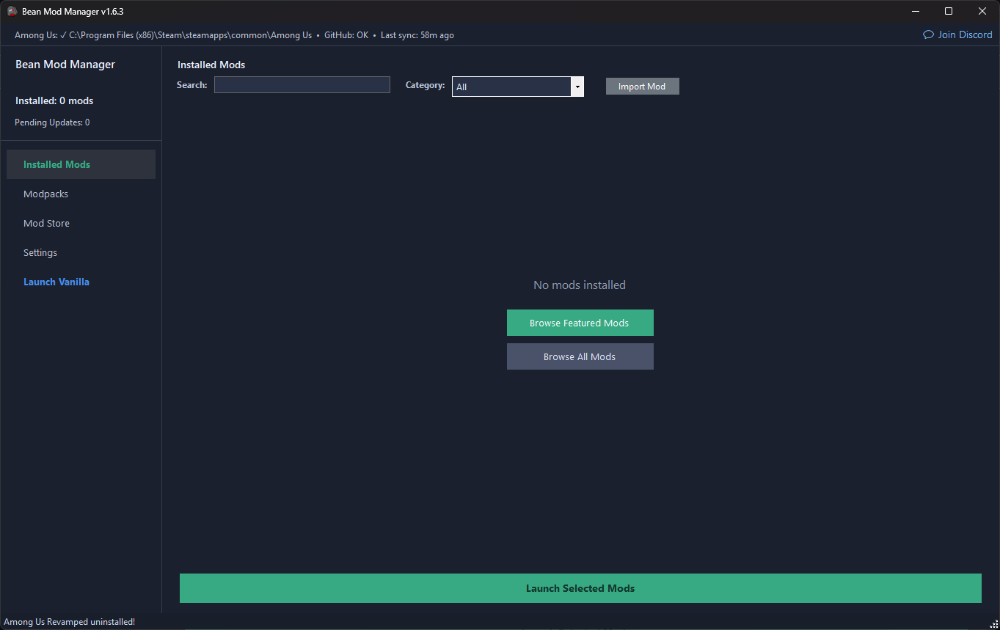
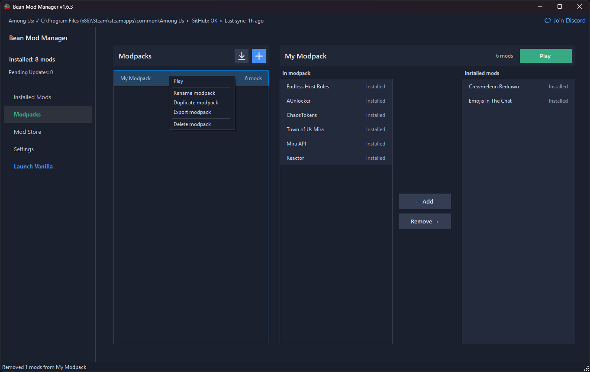
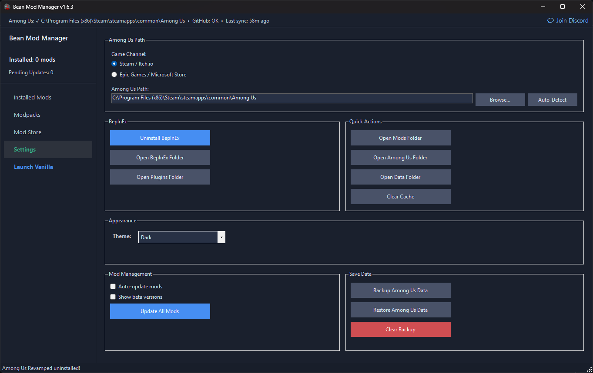

<p align="center">
  <a href="https://github.com/rewalo/BeanModManager/releases">
    
  </a>
  <a href="https://www.curseforge.com/among-us/all-mods/bean-mod-manager">
    
  </a>
  <a href="https://discord.gg/2V6Vn4KCRf">
    
  </a>
</p>

<h1 align="center">Bean Mod Manager</h1>

<p align="center">
  A straightforward mod manager for <strong>Among Us</strong> on Windows.<br>
  Install, organize, update, and switch between 50+ mods from one place.
</p>

<p align="center">
  <strong><a href="https://github.com/rewalo/BeanModManager/releases/latest">Download</a></strong>
  &nbsp;&middot;&nbsp;
  <a href="https://discord.gg/2V6Vn4KCRf">Discord</a>
  &nbsp;&middot;&nbsp;
  <a href="https://github.com/rewalo/BeanModManager/issues">Report an issue</a>
</p>

<p align="center">
  <a href="Images/Screenshot.png">
    
  </a>
</p>

<table>
  <tr>
    <td width="33%" align="center">
      <a href="Images/Screenshot_1.png"></a>
      <sub><strong>Installed mods</strong></sub>
    </td>
    <td width="33%" align="center">
      <a href="Images/Screenshot_3.png"></a>
      <sub><strong>Modpacks</strong></sub>
    </td>
    <td width="33%" align="center">
      <a href="Images/Screenshot_2.png"></a>
      <sub><strong>Settings</strong></sub>
    </td>
  </tr>
</table>

<p align="center"><sub>Click any screenshot to view it at full size.</sub></p>

## Features

- **First Launch Wizard:** Guided setup for new users  
- **Automatic Detection:** Steam, Epic Games, MS Store  
- **Smart Mod Management:** Multiple installed, one active  
- **Dependency Management:** Reactor, MiraAPI handled automatically  
- **Update Checker:** Notifies you when updates are available  
- **Incompatibility Detection:** Warns of conflicts before installation  
- **Search and Filter:** Quickly find mods using categories and search  
- **Bulk Actions:** Install, uninstall, or update multiple mods  
- **Theme Support:** Light and dark themes with auto-detection  
- **Virtualized UI:** Smooth performance with large mod lists  
- **Steam Depot Support:** Automatically downloads required game versions  

---

## How to Install

1. Download the latest release from the [Releases page](https://github.com/rewalo/BeanModManager/releases).  
2. Run `BeanModManager-[Version]-Installer.msi`.  
3. Choose optional desktop or Start Menu shortcuts.  
4. Launch the application.  
5. Complete the First Launch Wizard (auto-detects installation and BepInEx setup).

---

## How to Use

1. Open Bean Mod Manager.  
2. Browse the **Mod Store** tab.  
3. Click **Install** on any mod.  
4. Manage installed mods in the **Installed Mods** tab.  
5. Click **Play** to launch Among Us with that mod.  
6. Use **Launch Vanilla** to play without mods.

---

## Included Mods

### Featured Mods
- Town of Host Enhanced (TOHE)  
- Town of Us Mira  
- Better CrewLink  
- Better-BCL  
- The Other Roles GM IA  
- Endless Host Roles  

### Gameplay Mods
- Better Among Us  
- Launchpad: Reloaded  
- All The Roles  
- The Other Roles  
- StellarRoles  
- Las Monjas  
- yanplaRoles  
- NewMod  
- CrowdedMod  
- ChaosTokens  
- Extreme Roles  
- Syzyfowy Town Of Us  
- SuperNewRoles!!!!  
- Nebula On The Ship  
- Divani Mods  
- Crewmeleon Redrawn  
- Overloaded  

### Host Mods
- Town of Host Optimized (TOHO)  
- More Gamemodes  
- Project Lotus: Continued  
- Minimum Level  
- Among Us Revamped  

### Fun Mods
- SmolMod  
- PropHunt  
- Cursed Among Us  
- Poké Lobby  
- Emojis In The Chat  
- TechTech's Sound Mod  

### Map Mods
- Unlock dleks ehT  
- Submerged  
- Better Polus  
- Level Imposter  

### Utility Mods
- AUnlocker  
- Impostor (private server)  
- Vanilla Enhancements  
- Mod Explorer  
- Game Logger  
- Outfit Changer  
- StringNameUtils  
- AleLuduMod  
- Perfect Comms  
- NotePad Mod  

Note: Epic/MS Store versions are detected automatically. Mods requiring Steam depot downloads are handled internally.

---

## Core Frameworks and Dependencies

Bean Mod Manager automatically manages required frameworks:

- Reactor  
- Mira API  

---

## Requirements

- Windows 10 or later  
- .NET Framework 4.8.1 or later  
- Among Us installed (Steam, Epic Games Store, Microsoft Store)  
- Internet connection for mod downloads and updates  

---

## Making a Mod Compatible

1. Publish a release on GitHub.  
2. Include:  
   - The mod `.dll` files, or  
   - A `.zip` containing the proper BepInEx structure  
3. Use version-specific naming if applicable (steam, epic, msstore).  
4. Open an issue or pull request with:  
   - Repo link  
   - Mod name, author, description  
   - Category  
   - Dependencies or incompatibilities  

---

## Building from Source

### Prerequisites
- Visual Studio 2019 or later  
- .NET Framework 4.8.1 development tools  

### Steps

```bash
git clone https://github.com/rewalo/BeanModManager.git
cd BeanModManager
```

Open `BeanModManager.sln`, restore NuGet packages, build, and run.

---

## Contributing

- To add a mod, open an issue or pull request.  
- To remove a mod, request removal via issue.  
- For bugs or feature requests, submit an issue on GitHub.  
- For real-time support and discussions, join our [Discord server](https://discord.gg/2V6Vn4KCRf).  

---

## License

Distributed under the GNU GPLv3 License. See the [LICENSE](LICENSE) file.

---

## Disclaimer

This project is not affiliated with Among Us or Innersloth LLC. It is not endorsed or sponsored by Innersloth LLC.
